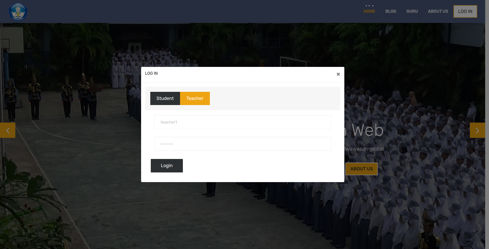

# Project Praktikum Pemrograman Web Dasar
## Website Sistem Informasi Akademik SMA

```
Oleh:
Habib Al Fauzan  (124200070)
Imam Agus Faisal (124200077)
```

## Welcome
Hai, Selamat Datang di project kami!

Website ini adalah website yang kami buat untuk keperluan tugas project mata kuliah praktikum pemrograman web dasar. Website ini bertujuan untuk sebagai sistem informasi akademik seperti input nilai dan sebagainya.


## Instruction
Untuk menggunakan project ini, import database yang ada di folder "database" ke dalam database anda dengan nama "univku".

Daftar Akun :
```
Guru :
	username : teacher1
	password : teacher1
	email 	 : teacher1@univku.ac.id

	username : teacher2
	password : teacher2
	email 	 : teacher2@univku.ac.id
```

```
Murid :
	username : student1
	password : student1
	email 	 : student1@univku.ac.id

	username : student2
	password : student2
	email 	 : student2@univku.ac.id

	username : student3
	password : student3
	email 	 : student3@univku.ac.id

	username : student4
	password : student4
	email 	 : student4@univku.ac.id
```

## Screenshot
### Homepage

### Login Page

### Dashboard Admin
